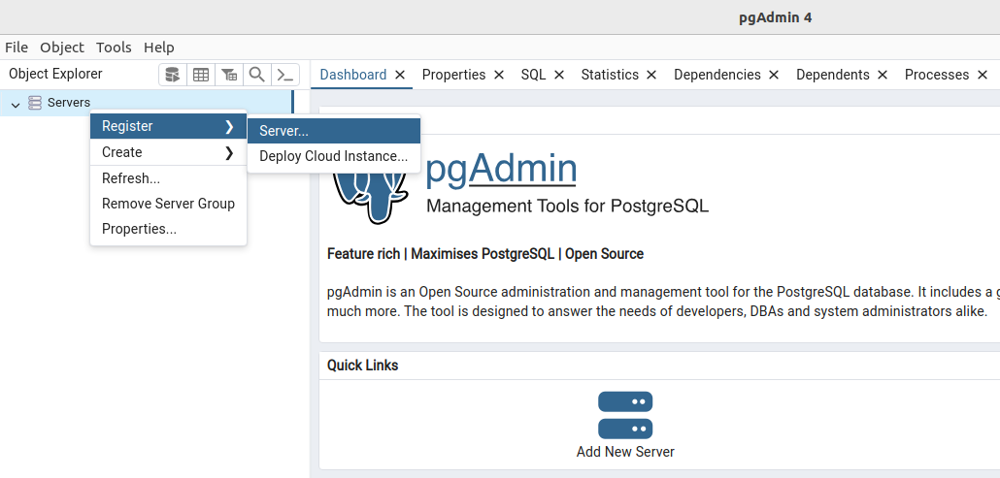
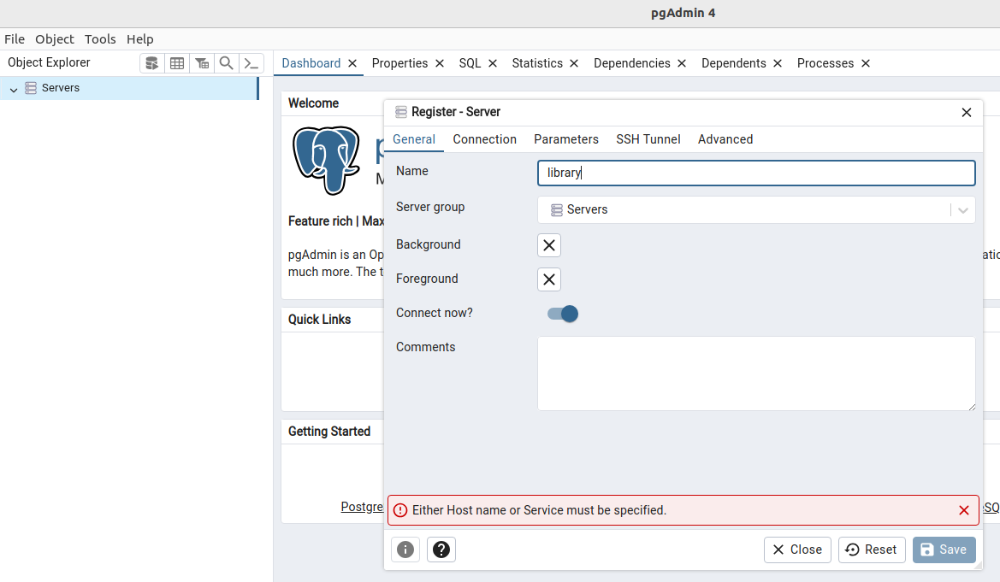
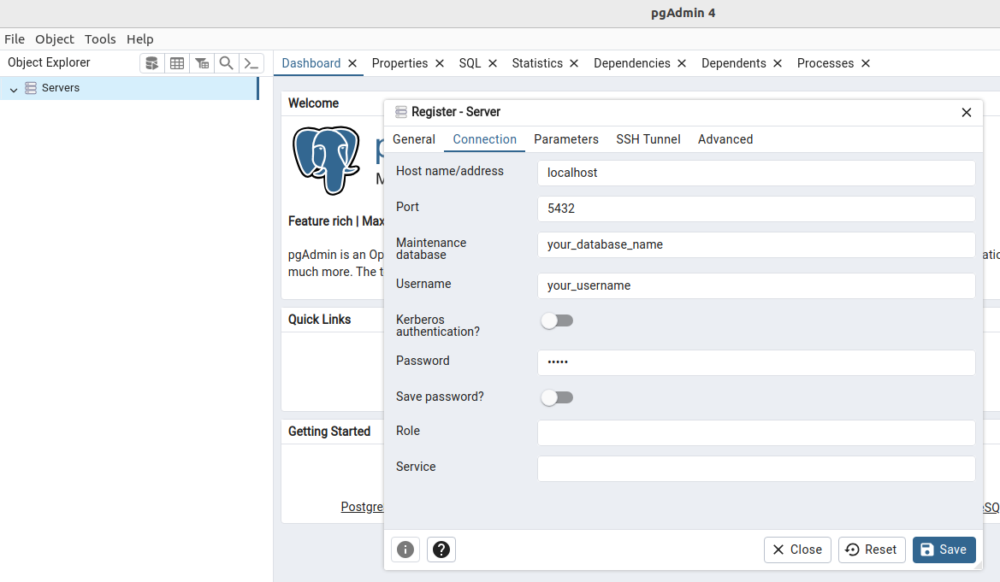
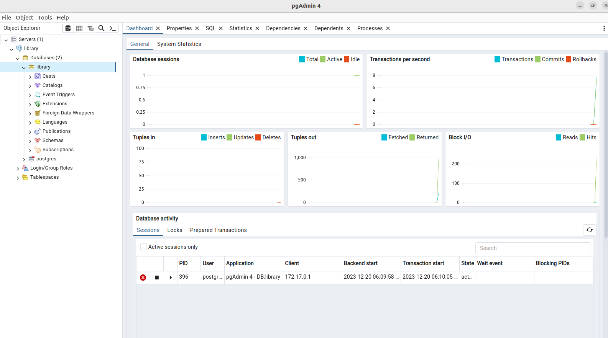

# library-management-system

### 1. Run postgres database in docker container

1. Pull the PostgreSQL docker image locally

```bash
docker pull postgres
```

2. Create a docker volume to persist data outside the container

```bash
docker volume create library_data
```

3. Run postgres image in docker container

```bash
docker run -d \
  --name postgres_container \
  -e POSTGRES_USER=your_username \
  -e POSTGRES_PASSWORD=your_password \
  -e POSTGRES_DB=your_database \
  -v library_data:/var/lib/postgresql/data \
  -p 5432:5432 \
  postgres
```

- Replace "your_username", "your_password", and "your_database" with your desired values.
- The -v flag is used to mount the volume, ensuring that data persists even if the container is removed.

### 2. Connect database in PgAdmin

Step 1: Register a server


Step 2: Fill server name


Step 3: Fill server connection


Step 4: You are connected

